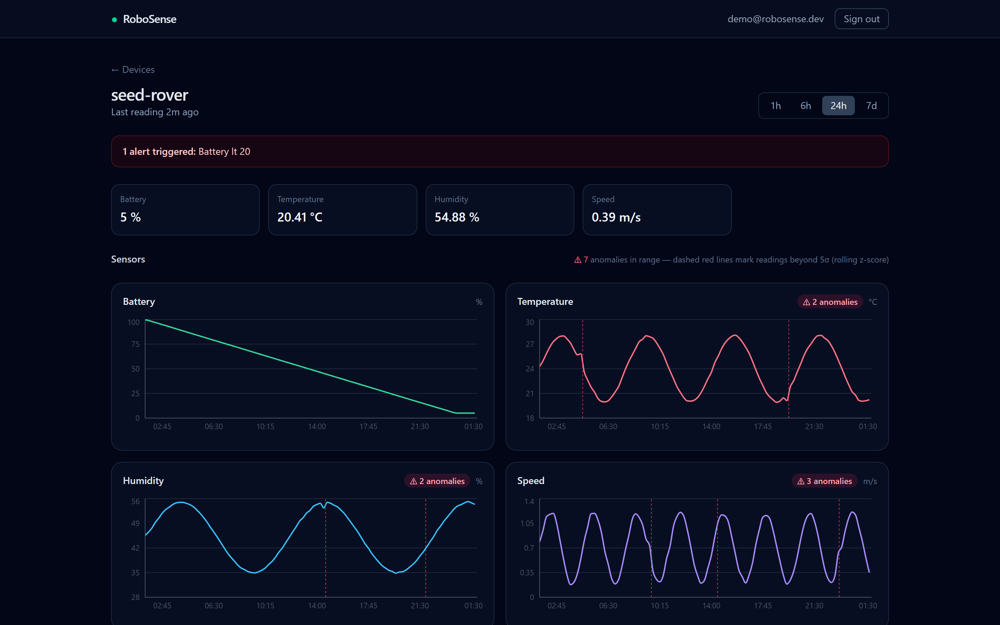

# RoboSense

> A focused, self-hostable telemetry backend + dashboard for robots and embedded devices. Flash the included ESP32 firmware and watch live sensor data in 5 minutes. ROS2 example included.

RoboSense is an open-source telemetry layer for robots and embedded devices. A
device POSTs sensor readings over HTTP; RoboSense stores them as time-series data
in TimescaleDB and shows them on a clean live dashboard.

> **Status:** complete and runnable end to end — backend + TimescaleDB, JWT auth &
> device management, telemetry ingest/query, the dashboard (live charts, threshold
> alerts, and rolling-z-score anomaly detection), a real flashable **ESP32
> firmware**, and a **ROS 2 bridge**. See the [Roadmap](#roadmap).



## Architecture

```
Device (ESP32 / ROS2 node / anything that can POST)
        │  HTTPS POST /api/telemetry  (X-API-Key header)
        ▼
FastAPI ingest endpoint ── validate ──► TimescaleDB hypertable (telemetry)
        ▲                                        │
        │ JWT-protected REST API                 │ time-bucketed queries
        ▼                                        ▼
Next.js dashboard ◄──── live + historical charts, device pages, alerts
```

A single FastAPI service backed by PostgreSQL + TimescaleDB. No microservices,
no message queues — the right amount of architecture for the job.

```
backend/     FastAPI app (api/, models/, schemas/, core/, db/) + pytest suite
frontend/    Next.js dashboard (App Router, TypeScript, Tailwind, Recharts)
firmware/    ESP32 firmware (Arduino .ino + PlatformIO)
examples/    ROS 2 rclpy telemetry bridge
docs/        screenshots
```

## Quickstart

Requires [Docker](https://docs.docker.com/get-docker/) and Docker Compose.

```bash
git clone <this-repo> robosense
cd robosense
make up
```

Then open:

- **Dashboard — http://localhost:3000**
- Interactive API docs — http://localhost:8000/docs
- API root — http://localhost:8000
- Liveness — http://localhost:8000/api/health

`make up` copies `.env.example` to `.env` on first run, builds the images, and
starts the database and backend. Stop everything with `make down`.

**See data immediately** — seed a demo device with 24h of fake telemetry:

```bash
make seed
```

It prints demo dashboard credentials (`demo@robosense.dev` / `demodemo123`) and a
device API key. Log in at http://localhost:3000 to see live charts and a triggered
battery alert. Or register a fresh account and add your own device. Try an ingest:

```bash
curl -X POST http://localhost:8000/api/telemetry \
  -H "X-API-Key: <printed-key>" \
  -H "Content-Type: application/json" \
  -d '{"device_id":"robot001","temperature":24.5,"battery":87,"speed":0.72}'
```

## Local development

`make` targets wrap Docker Compose:

| Command       | What it does                                                  |
| ------------- | ------------------------------------------------------------ |
| `make up`     | Build and start the stack (db + backend + frontend) in the background |
| `make seed`   | Create a demo device + 24h of fake telemetry                 |
| `make down`   | Stop the stack (keeps the database volume)                   |
| `make logs`   | Follow logs from all services                               |
| `make test`   | Run the backend test suite inside the container             |
| `make lint`   | Run `ruff` lint inside the container                        |
| `make clean`  | Stop the stack and delete the database volume               |

**No `make` (e.g. on Windows)?** Run the underlying commands directly:

```bash
# first time only
cp .env.example .env            # or: copy .env.example .env   (Windows)

docker compose up -d --build    # == make up
docker compose exec backend pytest -q   # == make test
docker compose down             # == make down
```

## API

Full interactive docs (with schemas and examples) are at `/docs`. Endpoints
available today:

| Method | Path | Auth | Purpose |
| ------ | ---- | ---- | ------- |
| `POST` | `/api/auth/register` | — | Create a dashboard user |
| `POST` | `/api/auth/login` | — | Exchange credentials for a JWT |
| `GET`  | `/api/auth/me` | JWT | Current user |
| `POST` | `/api/devices` | JWT | Create a device (returns its API key **once**) |
| `GET`  | `/api/devices` | JWT | List your devices |
| `GET`/`PATCH`/`DELETE` | `/api/devices/{id}` | JWT | Get / rename / delete a device |
| `POST` | `/api/devices/{id}/regenerate-key` | JWT | Rotate a device's API key |
| `POST` | `/api/telemetry` | API key | Ingest a reading (flat `sensor: value` JSON) |
| `GET`  | `/api/telemetry` | JWT | Query telemetry, optionally downsampled |
| `GET`  | `/api/telemetry/latest` | JWT | Latest reading per sensor (snapshot) |
| `GET`  | `/api/telemetry/summary` | JWT | Hourly rollup from the continuous aggregate |
| `GET`  | `/api/telemetry/anomalies` | JWT | Rolling z-score anomaly detection |
| `GET`/`POST`/`DELETE` | `/api/devices/{id}/alerts[...]` | JWT | Manage threshold alert rules |
| `GET`  | `/api/devices/{id}/alerts/status` | JWT | Evaluate alert rules vs latest readings |

Passwords are hashed with Argon2; device API keys are random tokens stored only
as a SHA-256 hash and shown exactly once.

**Ingestion** (`POST /api/telemetry`, `X-API-Key` header) accepts a flat payload —
every numeric key becomes a `sensor_name: value` row, identified by the device's
API key. An optional `timestamp` lets a device flush readings buffered during a
network drop; otherwise the server stamps receive time. Ingestion is rate-limited
per device.

**Querying** (`GET /api/telemetry`, JWT) takes `device_id` (required),
`sensor_name`, `start`/`end`, `order` (`asc`/`desc`), and `limit`/`offset`. Pass
`bucket` (`1s`,`10s`,`1m`,`5m`,`15m`,`1h`,`1d`) with `agg` (`avg`/`min`/`max`) to
downsample with TimescaleDB `time_bucket`.

## Dashboard

A Next.js dashboard (http://localhost:3000) for the device owner:

- **Device list** — cards with each device's latest readings and a live alert badge.
- **Per-device view** — current readings, live + historical charts (Recharts) with a
  `1h / 6h / 24h / 7d` range selector, polling every few seconds.
- **Threshold alerts** — add per-sensor rules (e.g. `battery < 20`); a banner and
  badge light up when the latest reading crosses the threshold. In-app only.
- **Anomaly detection** — a rolling z-score (computed in-database with a window
  function) flags readings that deviate from their recent history; the charts mark
  them with dashed red lines and a per-sensor count.
- **Device management** — create devices (API key shown once), rotate keys, delete.

Auth is JWT-based (register / login). See the screenshot at the top.

## Hardware: ESP32 firmware

A real, flashable ESP32 example lives in
[`firmware/esp32/`](firmware/esp32/README.md). It runs on a bare ESP32 dev board
with no extra wiring (reporting internal temperature, WiFi signal, free heap, and
uptime), or with a DHT22 for ambient temperature/humidity. It is built for the
flaky networks robots actually use:

- non-blocking WiFi reconnect with exponential backoff,
- an NTP-synced clock so readings carry an accurate capture time, and
- **offline buffering** — readings taken while disconnected are queued and resent
  with their original timestamps once the link returns, so a network gap becomes
  a gap-free series in the dashboard rather than a pile-up at reconnect.

It compiles cleanly via PlatformIO (`pio run`) or the Arduino IDE — see the
[firmware README](firmware/esp32/README.md) for wiring and flashing.

## ROS 2 bridge

For robots already running ROS 2, [`examples/ros2/`](examples/ros2/README.md) is a
`rclpy` package (`telemetry_bridge`) that subscribes to topics and forwards them
to the ingest API. It batches the latest value per sensor and POSTs on a timer, so
high-rate topics stay under the per-device rate limit. Bridges
`sensor_msgs/BatteryState` and `std_msgs/Float64` out of the box, configurable via
ROS 2 parameters.

```bash
ros2 run telemetry_bridge bridge --ros-args \
  -p api_key:=rsk_your_device_api_key -p device_id:=ros2-robot
```

## Tech stack

- **Backend:** Python 3.13, FastAPI, Uvicorn, Pydantic v2, SQLAlchemy 2 (async), asyncpg
- **Database:** PostgreSQL + TimescaleDB — telemetry is a hypertable with an hourly
  **continuous aggregate** for fast historical queries, plus **compression** and
  **retention** policies so storage stays bounded as data grows
- **Frontend:** Next.js (App Router) + TypeScript + Tailwind + Recharts
- **Firmware:** ESP32 (Arduino / PlatformIO)
- **ROS 2:** `rclpy` bridge node (`sensor_msgs` / `std_msgs` → ingest API)
- **Dev/CI:** Docker Compose, Makefile, pytest, ruff, GitHub Actions

## Running tests

```bash
make test            # inside the running stack
# or, against a local Postgres/Timescale on :5432:
cd backend && pip install -e ".[dev]" && pytest -q
```

## Roadmap

- [x] **M1** — Foundation: Docker Compose, TimescaleDB, FastAPI healthchecks, CI
- [x] **M2** — Auth (JWT) + device management with per-device API keys
- [x] **M3** — Telemetry ingest + time-bucketed query API + seed script
- [x] **M4** — ESP32 firmware example (WiFi, POST loop, reconnect handling)
- [x] **M5** — Next.js dashboard: live + historical charts, threshold alerts
- [x] **M6** — ROS 2 bridge example + OpenAPI / docs polish
- [x] **M7** _(stretch)_ — anomaly flag (rolling z-score)

## How it compares

Production fleet platforms like [Foxglove](https://foxglove.dev/),
[InOrbit](https://www.inorbit.ai/), and [Formant](https://formant.io/) are mature,
feature-rich, and the right call for operating fleets at scale. RoboSense is not
trying to compete with them. It is the minimal, self-hostable option for
individuals, students, and early prototypes who want a clean telemetry backend +
dashboard they fully own, running in minutes on their own machine.

## Contributing

Issues and pull requests are welcome. Commits follow
[Conventional Commits](https://www.conventionalcommits.org/). Run `make lint` and
`make test` before opening a PR.

## License

[MIT](LICENSE)
